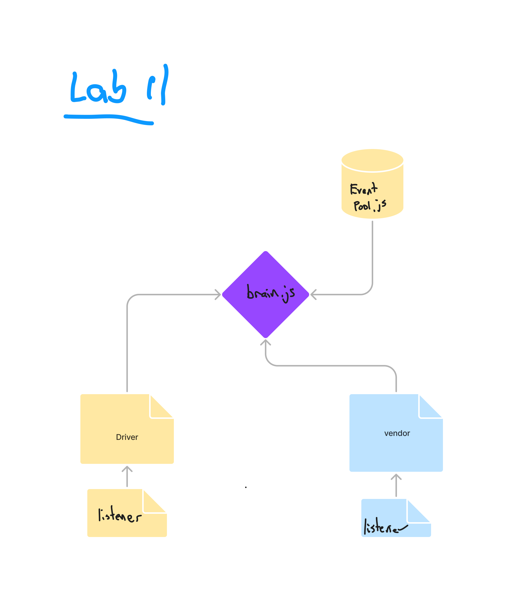

# LAB - 11

## Deployment Test

### Author: John Cokos

- [tests report](https://github.com/codefellows/code-401-javascript-example-lab/actions)

### Setup

#### `.env` requirements

- N/A

#### Running the app

- `npm start`
- Endpoint: `/status`
  - Returns console.log of a preset example order 

```javascript
EVENT {
  event: 'pickup',
  time: '2023-08-06T00:22:59.107Z',
  payload: Order {
    store: 'amazon',
    orderId: '894f538f-c99d-4b64-8ed8-edbd0e5795db',
    customer: 'Bertha Fletcher',
    address: '1016 Cedveg Lane Henumbuj, NE, 86713'
  }
}
DRIVER: picked up 894f538f-c99d-4b64-8ed8-edbd0e5795db
EVENT {
  event: 'in-transit',
  time: '2023-08-06T00:22:59.111Z',
  payload: Order {
    store: 'amazon',
    orderId: '894f538f-c99d-4b64-8ed8-edbd0e5795db',
    customer: 'Bertha Fletcher',
    address: '1016 Cedveg Lane Henumbuj, NE, 86713'
  }
}
EVENT {
  event: 'delivered',
  time: '2023-08-06T00:22:59.112Z',
  payload: Order {
    store: 'amazon',
    orderId: '894f538f-c99d-4b64-8ed8-edbd0e5795db',
    customer: 'Bertha Fletcher',
    address: '1016 Cedveg Lane Henumbuj, NE, 86713'
  }
}
```

#### Tests

- Unit Tests: `npm run test`

#### UML



